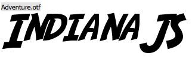

# IndianaJS

```
Work in progress, will arrive soon.
```

A spatial location library for Web-of-Things-enabled web sites.
Check out some web-apps that use the library:

 * [IoT-Compass](https://github.com/frostyandy2k/iot-compass)
 * [Relate-Gateways](https://github.com/frostyandy2k/relate-gateways)


## Feature overview

 * Relative location tracking
 * Device querying and scanning

## Usage

```
	<script src="js/indiana.js"></script>
	
    <script>
        $('body').append("<div id='target'></div>");
        var okstring = 'OK';

        registerThingEvent('target', function() {
         $('#target').text(okstring);
        });

        indiana.initializeEventListeners();

        indiana.dispatchSpatialFocusEvent('target');

        assert.equal($('#target').html(), okstring);
    </script>
   
```

### Authors and Contributors
Many Thanks to Jack Unseld (@junseld) and Till Riedel (@riedel)
